# SimpleCaculator

## 개요
- C# 프로그래밍 학습
- 1줄 소개: double 타입 변환과 TryParse를 활용한 예외 처리를 통해 데이터 정밀도와 프로그램 안정성을 확보한 계산기입니다.
- 사용한 플랫폼:
    -  C#, .NET Windows Forms, Visual Studio, GitHub
- 사용한 컨트롤:
    - TextBox(수식 표시 및 결과 출력), Button(숫자, 연산자, 기능 버튼), MessageBox(예외 알림 팝업)
- 사용한 기술과 구현한 기능:
    - double 타입을 이용한 실수 연산 구현 및 나눗셈 정밀도 향상
    - double.TryParse를 활용하여 숫자가 아닌 문자 입력 시 프로그램 강제 종료 방지 및 사용자 안내 로직 적용
    - 0으로 나누기 시도 시 에러 메시지 출력 및 상태 초기화 기능
    - Contains() 메서드를 이용한 소수점(.) 중복 입력 방지 및 자동 보정 기능
    - Substring을 활용한 백스페이스(한 글자 지우기) 및 CE/C 초기화 기능
    - 결과값 출력 후 연산자 클릭 시 기존 결과값을 피연산자로 승격시켜 계산을 이어가는 연속 계산 로직

## 실행 화면 (과제1)
- 과제1 코드의 실행 스크린샷

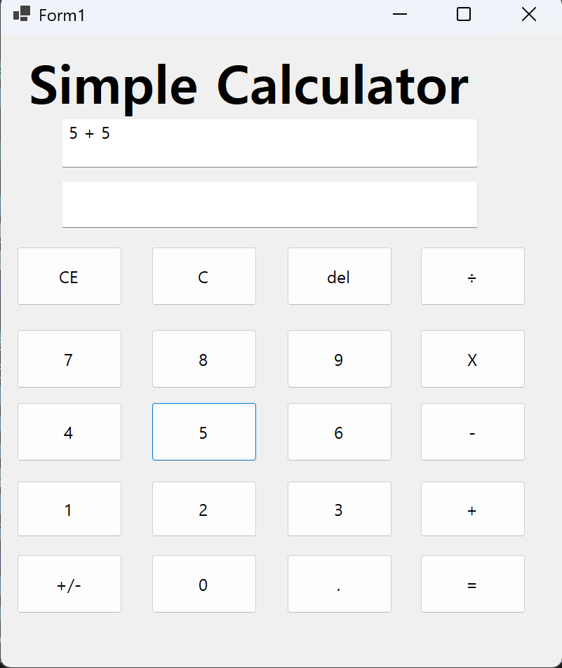
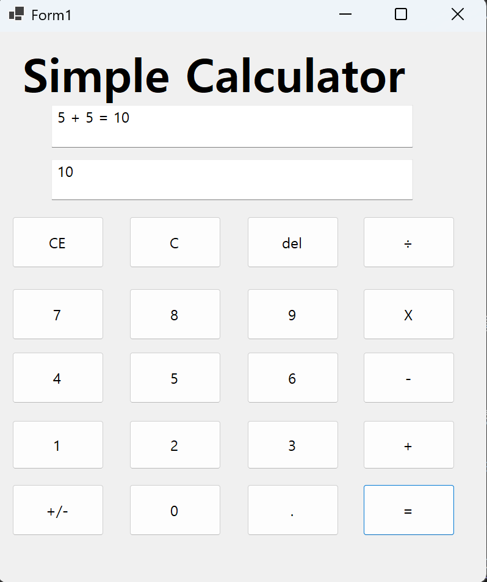

- 과제 내용
  - 컨트롤 배치와 기본적인 속성 설정합니다.
  - 입력 내용을 2가지 방법으로 표시하는 기능 구현합니다.
  - 계산기의 더하기 기능 구현합니다.

- 구현 내용과 기능 설명
  - 숫자 버튼 클릭 시 데이터를 누적하고 실시간으로 수식을 표시한다.     
    사용한 코드:      
    `tempInput += btn.Text;`
    `txtFormular.Text += btn.Text;`
  - 입력된 문자열을 실수형으로 변환하여 더하기 계산을 수행한다.    
    사용한 코드:   
    `if (!double.TryParse(tempInput, out firstNumber)) return;`
  - 계산된 결과값을 문자열로 변환하여 화면에 출력한다.   
    사용한 코드:   
    `txtInput.Text = "= " + result.ToString();`
## 실행 화면 (과제2)
- 과제2 코드의 실행 스크린샷

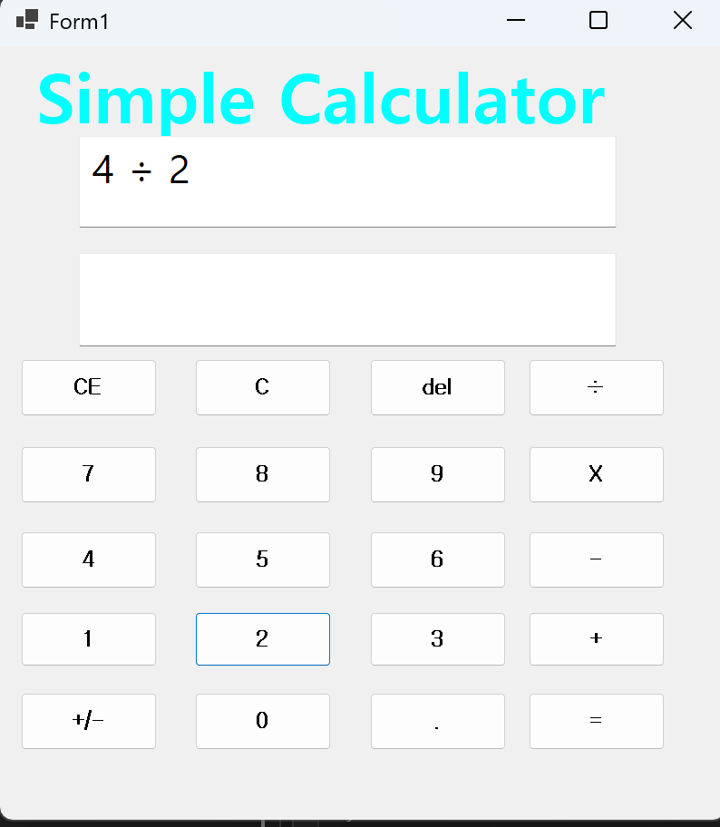
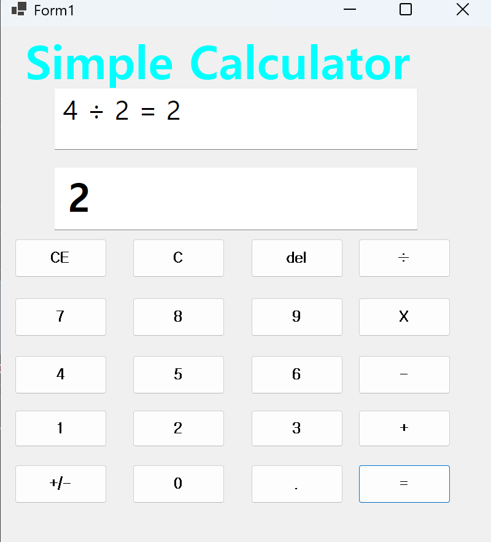

- 과제 내용
  - 사칙연산(+, -, *, /) 버튼을 모두 배치하고 이벤트를 연결합니다.
  - 연산자 버튼 클릭 시 현재까지 입력된 숫자를 첫 번째 피연산자로 저장합니다.
  - 사칙연산 우선순위와 상관없이 입력 순서에 따른 연산 기초를 다집니다.

- 구현 내용과 기능 설명
  - 각 연산자 버튼 클릭 시 해당 기호를 변수에 저장하고 수식 창에 표시한다.    
    사용한 코드:    
    `currentOperator = btn.Text;`     
    `txtFormular.Text += " " + currentOperator + " ";`
  - 뺄셈, 곱셈, 나눗셈에 대한 조건문 로직을 추가하여 연산을 수행한다.    
    사용한 코드:    
    `if (currentOperator == "-") doubleResult = doubleFirstNumber - secondNumber;`     
    `else if (currentOperator == "*" || currentOperator == "X") doubleResult = doubleFirstNumber * secondNumber;`    
  - 연산자 클릭 시 다음 숫자를 입력받기 위해 입력 임시 변수를 초기화한다.    
    사용한 코드:    
    `tempInput = "";`    
    `txtInput.Clear();`    

## 실행 화면 (과제3)
- 과제3 코드의 실행 스크린샷

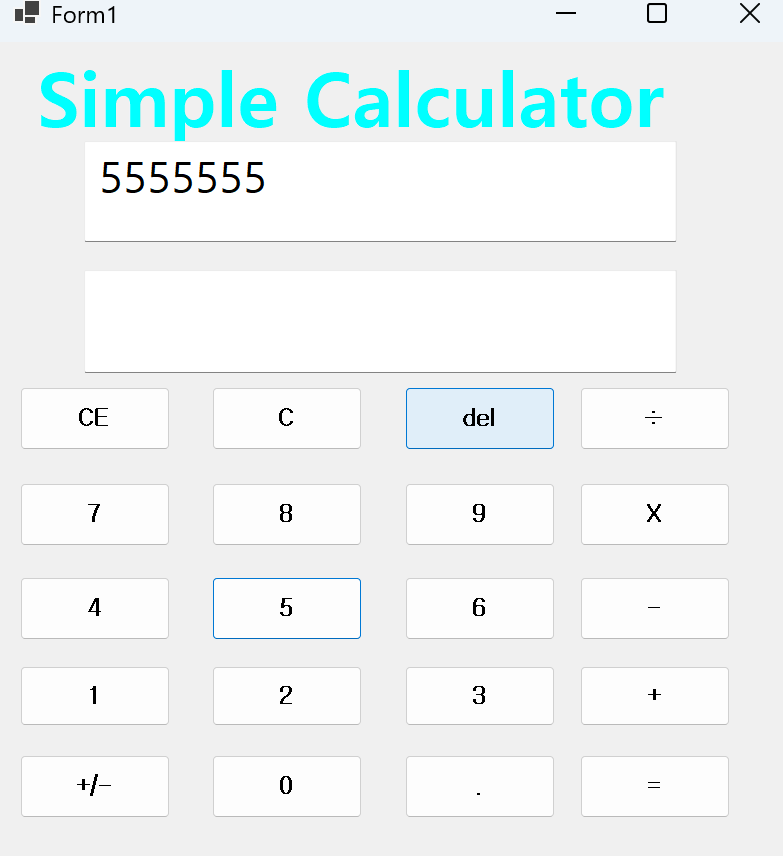
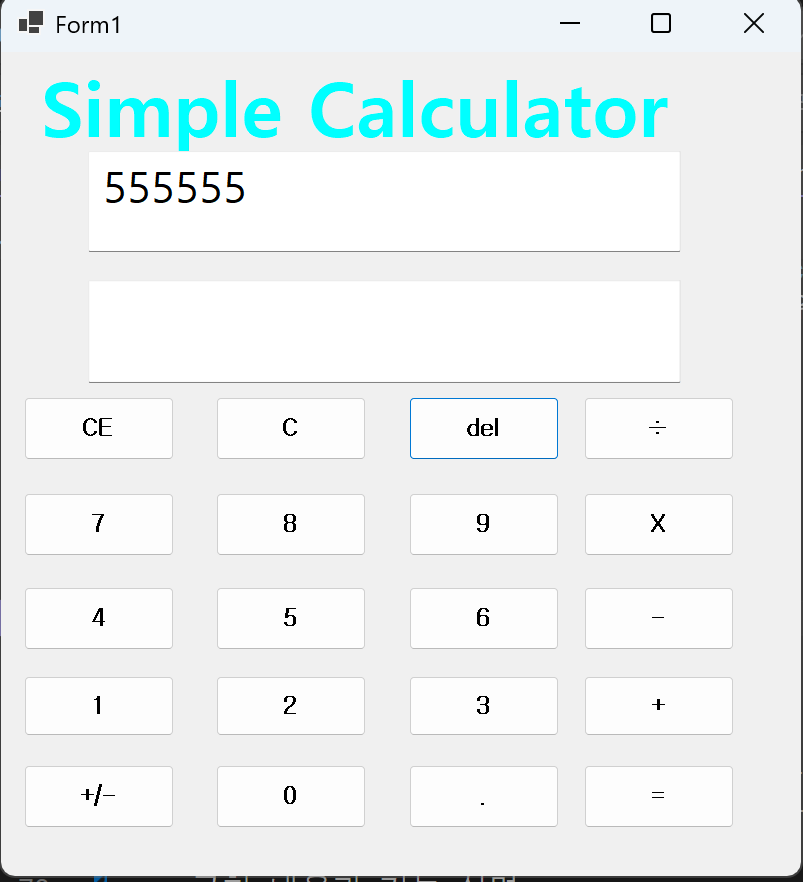
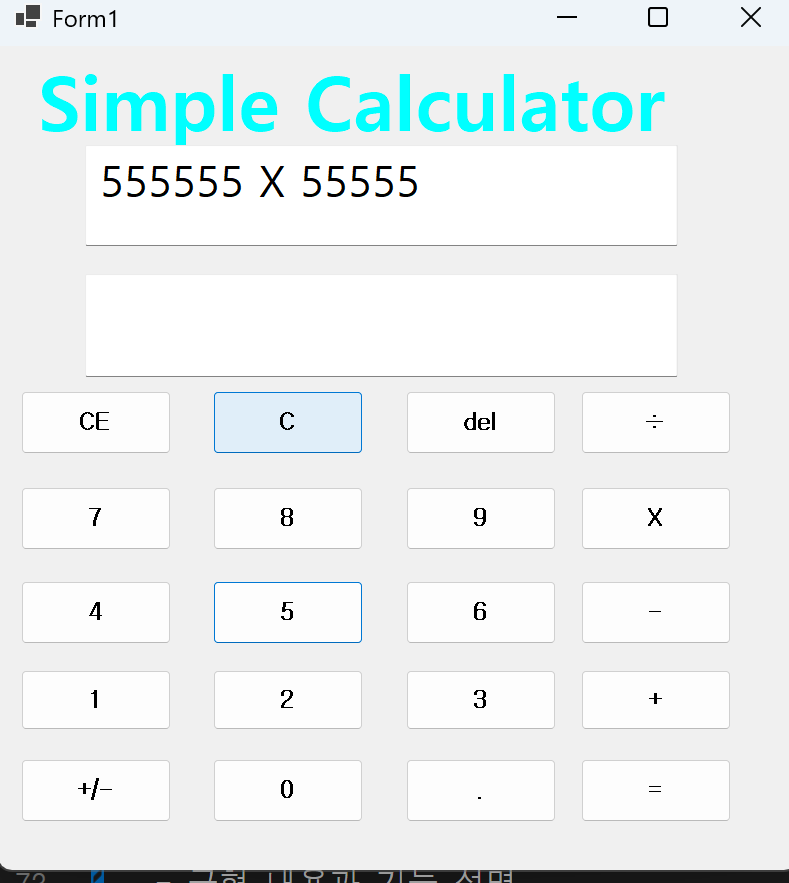
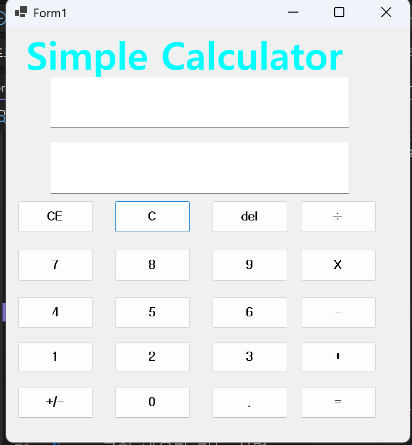
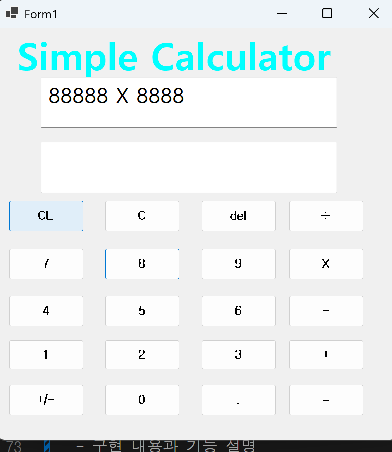
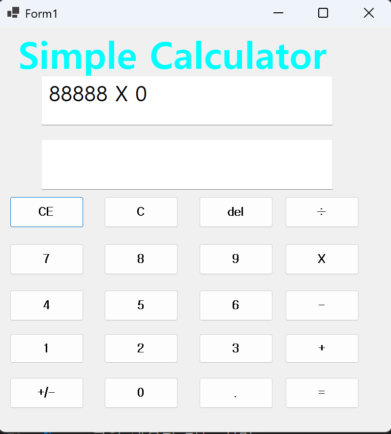

- 과제 내용
  - C(Clear), CE(Clear Entry), Backspace(del) 기능을 구현합니다.
  - 잘못 입력한 숫자나 전체 기록을 지우는 편의 기능을 추가합니다.
  - 문자열 처리를 통해 입력된 데이터의 마지막 글자를 제거하는 로직을 작성합니다.

- 구현 내용과 기능 설명
  - 백스페이스 기능을 통해 마지막에 입력된 한 글자만 제거한다.   
    사용한 코드:    
    `tempInput = tempInput.Substring(0, tempInput.Length - 1);`   
    `txtFormular.Text = txtFormular.Text.Substring(0, txtFormular.Text.Length - 1);`  
  - CE 버튼 클릭 시 현재 입력 중인 숫자를 0으로 초기화하고 화면을 갱신한다.    
    사용한 코드:   
    `tempInput = "0";`   
    `txtFormular.Text = txtFormular.Text.Substring(0, txtFormular.Text.Length - tempInput.Length) + "0";`   
  - C 버튼 클릭 시 모든 변수와 텍스트박스를 초기화하여 새 계산 상태로 만든다.   
    사용한 코드:   
    `txtInput.Clear(); txtFormular.Clear();`   
    `tempInput = ""; firstNumber = 0; currentOperator = "";`  

## 실행 화면 (과제 4)
- 과제 4 코드의 실행 스크린샷

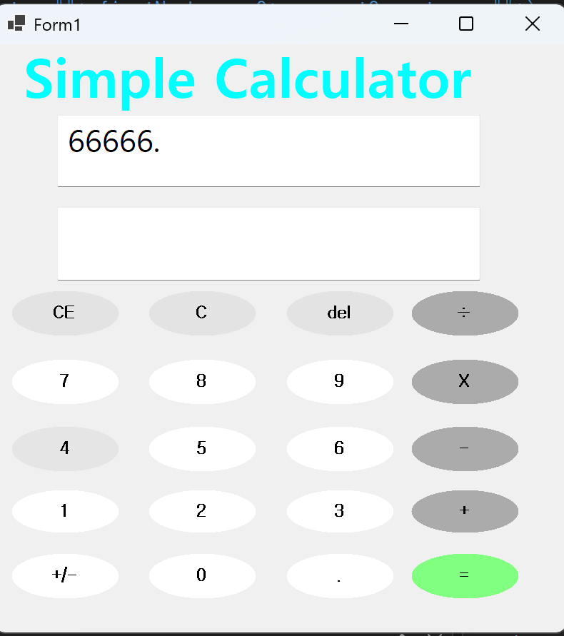
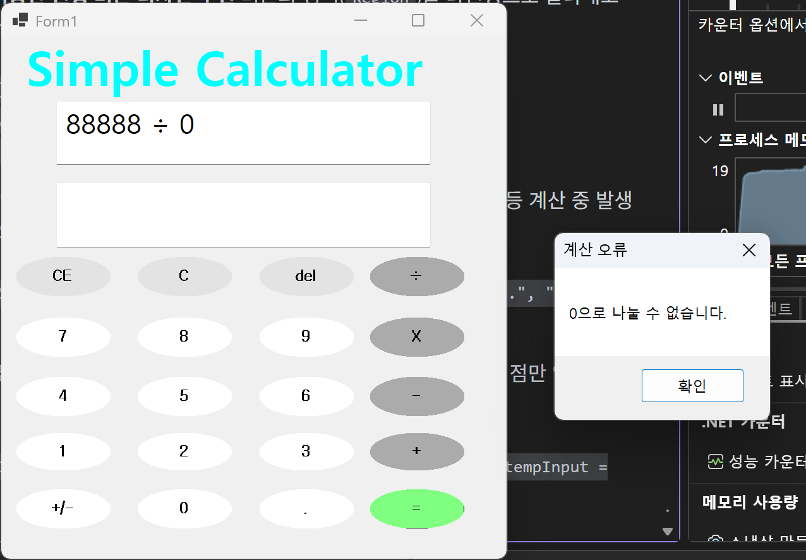
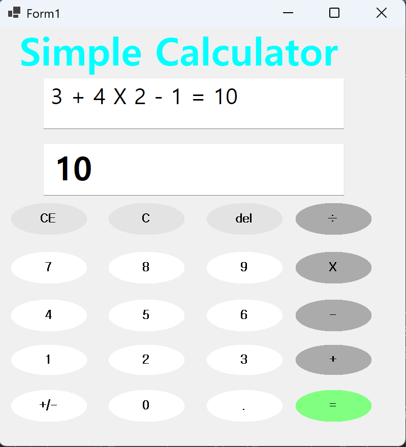
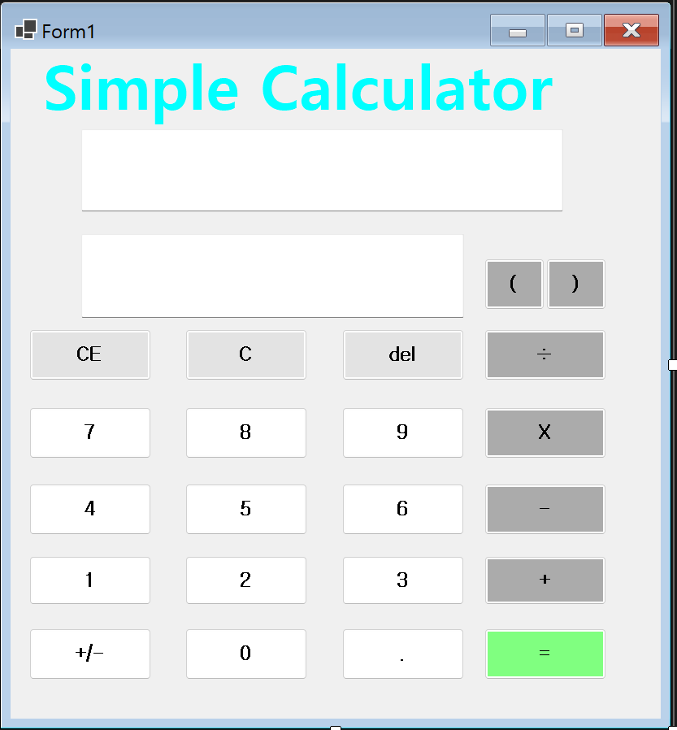

- 과제 내용
  - **(추가)복수 수식 일괄 계산**: `DataTable.Compute`를 활용하여 사칙연산 우선순위가 적용된 연속 계산 기능을 구현합니다.
  - **커스텀 UI 디자인**: `GraphicsPath`를 이용하여 각진 버튼을 현대적인 원형(Round) 버튼으로 스타일링합니다.
  - **예외 처리 강화**: `try-catch`문을 도입하여 0으로 나누기 등 산술 오류 시 프로그램의 안정성을 확보합니다.
  - **복합 수식 및 괄호 연산**: 괄호($()$)가 포함된 복잡한 수식의 우선순위를 정확히 계산하는 기능을 구현합니다.

- 구현 내용과 기능 설명
  - **(추가)괄호(Parentheses)를 활용한 연산 우선순위 제어** 사용자가 입력한 괄호 기호를 수식 문자열에 포함시키고, `DataTable.Compute` 엔진을 통해 수학적 규칙에 따른 우선순위 계산을 수행한다.
    사용한 코드:    
    `txtFormular.Text += "(";`   
    `table.Compute(mathExpression, "");`    

  - **문자열 수식 일괄 계산 및 연산 우선순위 적용** 연산자를 누를 때마다 계산하지 않고 수식을 문자열로 쌓은 뒤, `=` 클릭 시 사칙연산 우선순위에 따라 한 번에 연산한다.  
    사용한 코드:  
    `string mathExpression = finalExpression.Replace("X", "*").Replace("÷", "/");`  
    `var computeResult = table.Compute(mathExpression, "");`

  - **GraphicsPath를 이용한 원형 버튼 디자인 구현** 버튼의 영역(`Region`)을 타원형으로 잘라내고 `FlatStyle.Flat` 설정을 통해 선명한 색상의 라운드 버튼을 구현한다.  
    사용한 코드:  
    `path.AddEllipse(0, 0, btn.Width, btn.Height);`  
    `btn.Region = new Region(path);`  
    `btn.FlatStyle = FlatStyle.Flat;`

  - **Try-Catch를 통한 안정적인 예외 처리** 0으로 나누기(`DivideByZeroException`) 등 계산 중 발생할 수 있는 시스템 오류를 감지하여 사용자 알림을 띄우고 상태를 초기화한다.  
    사용한 코드:  
    `catch (DivideByZeroException) { MessageBox.Show("0으로 나눌 수 없습니다.", "계산 오류"); }`    

  - **소수점 중복 방지 및 자동 보정 로직** 한 숫자 내 중복 입력을 차단하고, 숫자 없이 점만 입력될 경우 UX 편의를 위해 자동으로 `0.`으로 변환한다.  
    사용한 코드:  
    `if (!tempInput.Contains(".")) { if (string.IsNullOrEmpty(tempInput)) tempInput = "0."; }`    

